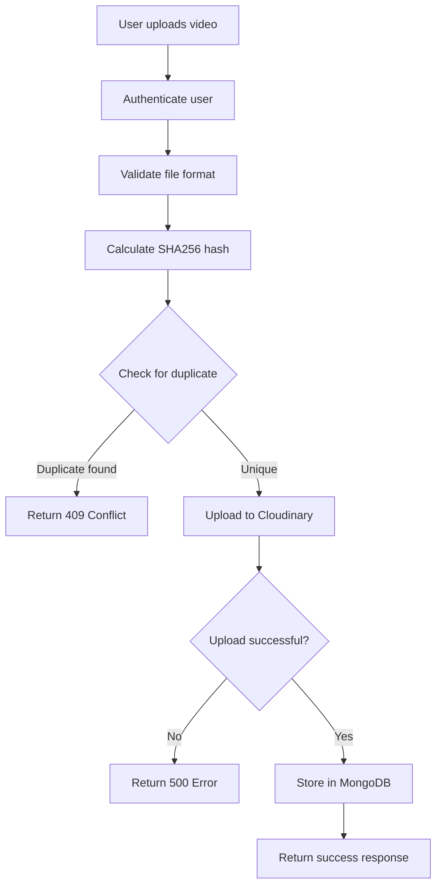

# Video Upload with Hash-Based Duplicate Detection

## Overview

The video upload system now includes automatic duplicate detection using SHA256 hashing. This prevents users from uploading the same video multiple times, even if the filename is different.

## Features Implemented

### 1. **Video Hash Calculation**

- **Algorithm**: SHA256
- **Purpose**: Generate unique fingerprint for each video
- **Implementation**: Hash is calculated from video content (not filename)

### 2. **Duplicate Detection**

- System checks if a video with the same hash already exists for the user
- If duplicate found: Returns HTTP 409 (Conflict) with existing video ID
- If unique: Proceeds with upload to Cloudinary

### 3. **Cloudinary Integration**

- Videos are uploaded to user-specific folders: `videodiscovery/users/{user_id}`
- Automatic optimization and transformation
- Returns secure URL, public_id, and metadata

### 4. **Database Storage**

- `video_hash` is now **required** (not optional)
- Unique compound index on `(user_id, video_hash)` prevents duplicates at DB level
- Additional metadata stored:
  - `cloudinary_public_id`: For future operations (delete, transform)
  - `video_format`: File format (mp4, mov, etc.)
  - `video_duration`: Video length in seconds

## API Changes

### Upload Video Endpoint

**Endpoint**: `POST /videos/upload`

**Request**:

- Content-Type: `multipart/form-data`
- Authentication: Required (JWT Bearer token or HttpOnly cookie)

**Parameters**:

```
file: Video file (required)
  - Supported formats: MP4, AVI, MOV, MKV, WEBM

intelligent_query: String (required)
  - User's description/query for the video
```

**Success Response** (200):

```json
{
  "video_id": "v1a2b3c4d5e6f",
  "file_url": "https://res.cloudinary.com/...",
  "video_hash": "abc123...",
  "status": "uploaded",
  "message": "Video uploaded successfully to Cloudinary"
}
```

**Error Responses**:

- **400 Bad Request**: Unsupported file format

```json
{
  "detail": "Unsupported file format. Supported formats: MP4, AVI, MOV, MKV, WEBM"
}
```

- **401 Unauthorized**: Missing or invalid authentication

```json
{
  "detail": "Invalid user authentication"
}
```

- **409 Conflict**: Duplicate video detected

```json
{
  "detail": "This video has already been uploaded. Video ID: v1a2b3c4d5e6f"
}
```

- **500 Internal Server Error**: Upload or processing failure

```json
{
  "detail": "Failed to upload video to Cloudinary. Please try again."
}
```

## Schema Changes

### VideoResponse

```python
class VideoResponse(BaseModel):
    video_id: str
    user_id: str
    file_url: str
    file_name: str
    intelligent_query: str
    video_hash: str  # NOW REQUIRED (was Optional)
    uploaded_at: datetime
```

### VideoInDB

```python
class VideoInDB(BaseModel):
    video_id: str
    user_id: str
    file_url: str
    file_name: str
    intelligent_query: Optional[str] = None
    video_hash: str  # NOW REQUIRED (was Optional)
    uploaded_at: datetime
```

## Database Indexes

New compound unique index ensures data integrity:

```python
# Compound unique index to prevent duplicate videos per user
videos_col.create_index(
    [("user_id", 1), ("video_hash", 1)],
    unique=True
)
```

## Upload Flow



## Testing

Use the provided `test_video_upload.py` script to:

1. Calculate hash of local video files
2. Compare hashes of two video files
3. Verify duplicate detection logic

```python
from test_video_upload import calculate_video_hash, test_duplicate_detection

# Get hash of a video
hash1 = calculate_video_hash("path/to/video.mp4")

# Compare two videos
test_duplicate_detection("video1.mp4", "video2.mp4")
```

## Frontend Integration

When uploading from frontend, use FormData:

```javascript
const formData = new FormData();
formData.append("file", videoFile);
formData.append("intelligent_query", userQuery);

const response = await fetch("/api/videos/upload", {
  method: "POST",
  headers: {
    Authorization: `Bearer ${accessToken}`,
  },
  body: formData,
});

if (response.status === 409) {
  // Handle duplicate video
  const data = await response.json();
  alert(data.detail); // "This video has already been uploaded..."
}
```

## Benefits

1. **Storage Optimization**: Prevents duplicate videos in Cloudinary (saves storage costs)
2. **Data Integrity**: Hash-based detection is more reliable than filename comparison
3. **User Experience**: Clear error message when duplicate detected
4. **Performance**: Efficient duplicate checking with indexed queries
5. **Security**: User authentication required, videos stored in user-specific folders

## Environment Requirements

Ensure these environment variables are set:

```
CLOUDINARY_CLOUD_NAME=your_cloud_name
CLOUDINARY_API_KEY=your_api_key
CLOUDINARY_API_SECRET=your_api_secret
```

## Notes

- Hash calculation happens before Cloudinary upload to save bandwidth
- Videos are organized in Cloudinary: `videodiscovery/users/{user_id}/`
- Each user can have the same video (hash checked per user, not globally)
- Maximum file size depends on Cloudinary plan and server configuration
